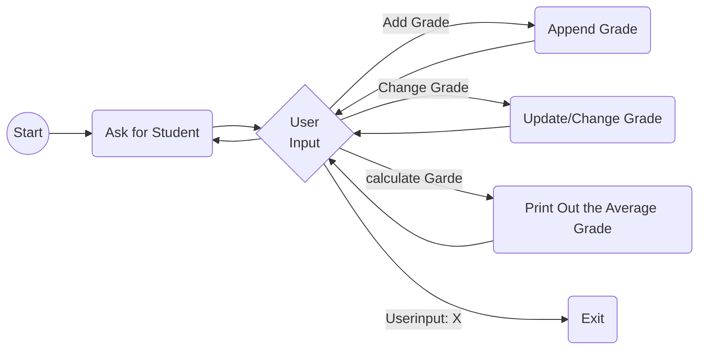

# Modul-319-A4

School Grading CLI

## Activity Diagram

```mermaid
    flowchart LR
    A((Start))-->B(Ask for Student)
    B-->C
    C-->B
    C{User\nInput}
    C-->|Add Grade|D(Append Grade)
    C-->|Change Grade|E(Update/Change Grade)
    C-->|calculate Garde|F(Print Out the Average Grade)
    D-->C 
    E-->C 
    F-->C
    C-->|Userinput: X|X(Exit)
```
