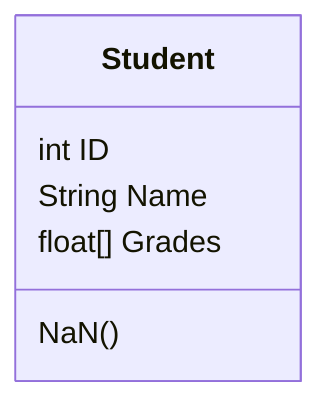
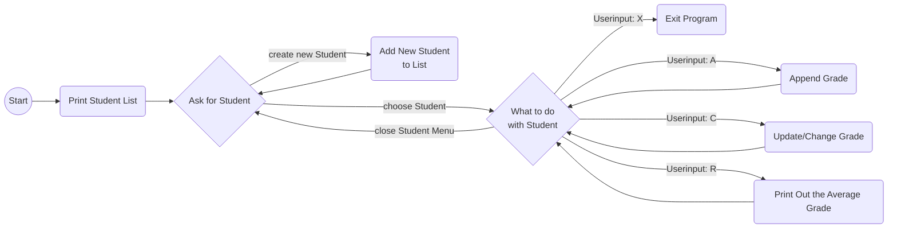

# Modul-319-A4

School Grading CLI

## Requirements

- able to Add new Student
- Update or add Grade to a Student
- calculate average Grade of student

## Student Object

```mermaid
    classDiagram
    class Student{
        int ID
        String Name
        float[] Grades
        NaN()
    }
```

## Activity Diagram

```mermaid
    flowchart LR
    A-->H(Print Student List)
    H-->B
    A((Start))
    B{Ask for Student}
    G-->B
    B-->|create new Student|G(Add New Student\nto List)
    B-->|choose Student|C
    C--->|close Student Menu|B
    C{What to do\nwith Student}
    C-->|Userinput: A|D(Append Grade)
    C-->|Userinput: C|E(Update/Change Grade)
    C-->|Userinput: R|F(Print Out the Average Grade)
    D--->C 
    E--->C 
    F--->C
    C-->|Userinput: X|X(Exit Program)
```
